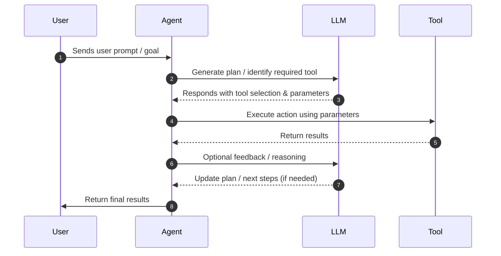

# Tools

- **Agentify now supports tools**: Agents can interact with external tools (REST APIs) as part of their workflows.

- Tool specifications are defined in `.yaml` files, similar to Agents, making them easy to version and configure.

- **Agent-to-Tool linkage**: Agents reference tools they can use, enabling dynamic execution during agentic workflows.

- New classes: `Tool` and `Action` classes have been added to simplify tool creation and invocation.

## Agentic Workflow

Agent class now implements the agent loop as illustrated in the below diagram:



- **User input**: A prompt is sent to the agent. The agent injects the associated tool schema into the prompt.

- **LLM decision**: The LLM returns structured JSON specifying which tool (if any) to invoke.

- **Action execution**: The agent parses the JSON and runs the action via `tool.invoke(action_name)`.

- **Final processing**: The LLM receives the tool’s output for any post-processing, formatting, or reasoning, then returns the final response to the user.

#### Feature: Multi Agent Orchestration

Add the ability for Agents to talk to other agents:

Example:

```yaml
name: ollama
description: AI Engineer
version: 0.1.0
model:
  provider: ollama
  id: devstral-small-2:24b
  api_key_env: OLLAMA_API_KEY
role: |
  You are an AI Security Engineer.
  Provide concise, practical answers with examples.
tools:
  - user_api
  - todo_api
agents:
  - agent_1 # <-- HERE
  - agent_2 # <-- HERE
```

## Design

I wanted to make tools declarative like agents, as they're lightweight interfaces to API endpoints.

So Agents just have a next section:

```bash
tools:
    - tool_a
    - tool_b
```

and these are references to `tool_a.yaml` and `tool_b.yaml` respectively.

Example: user_api.yaml

```yaml
name: user_api
version: "1.0.0"
description: Manage users in the system
vendor: jsonplaceholder
endpoint: "https://jsonplaceholder.typicode.com/"

actions:
  list_users:
    method: GET
    path: /users
    params:
      query:
        page: integer
        limit: integer

  create_user:
    method: POST
    path: /users
    params:
      body:
        name: string
        email: string
```

To then link the tool to the agent, you simply update the Agent YAML:

```yaml
name: ollama
description: AI Engineer
version: 0.1.0
model:
  provider: ollama
  id: devstral-small-2:24b
  api_key_env: OLLAMA_API_KEY
role: |
  You are an AI Security Engineer.
  Provide concise, practical answers with examples.
tools:
  - user_api # <-- HERE
  - todo_api # <-- HERE
```
